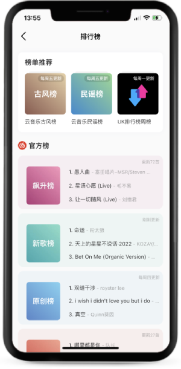

[](https://github.com/masterxing/flutter_cloud_music/stargazers)
[](https://github.com/masterxing/flutter_cloud_music/network)
[](https://github.com/masterxing/flutter_cloud_music/issues) 

> SDK Version
```
masterxing ~ % flutter doctor
Doctor summary (to see all details, run flutter doctor -v):
[✓] Flutter (Channel stable, 2.10.4, on macOS 11.4 20F71 darwin-x64, locale
    zh-Hans-CN)
[✓] Android toolchain - develop for Android devices (Android SDK version 30.0.3)
[✓] Xcode - develop for iOS and macOS (Xcode 13.1)
[✓] Android Studio (version 2020.3)
[✓] VS Code (version 1.59.0)
```

**如果您觉得还不错的话，加个🌟吧~**

# 相关说明

   * 基于Flutter开发，适配 Android 与 iOS。
   * 高度还原网易云APP，所有UI按照网易云来实现。
   * 项目中的接口数据均来自[NeteaseCloudMusicApi](https://github.com/Binaryify/NeteaseCloudMusicApi)真实有效
   * 项目中用到的Widget能覆盖90%
   * 音乐播放部分使用原生插件实现
   
   > Api部署在[Vercel](https://vercel.com/)上，响应比较慢。你也可以把[NeteaseCloudMusicApi](https://github.com/Binaryify/NeteaseCloudMusicApi)跑在本地，修改项目里的host进行访问。

- ### [如果克隆太慢或者图片看不到，可尝试从码云地址下载](https://gitee.com/master_xing/flutter_cloud_music)


# Demo
### Debug版本下载体验


### Gif


### Light



### Dark


# 声明
- 此项目仅供学习交流，禁止用于商业及非法用途，如产生法律纠纷与本人无关
- 并不是一个破解软件，不提供下载付费歌曲！
# 如果您觉得还不错的话，加个🌟吧~**
